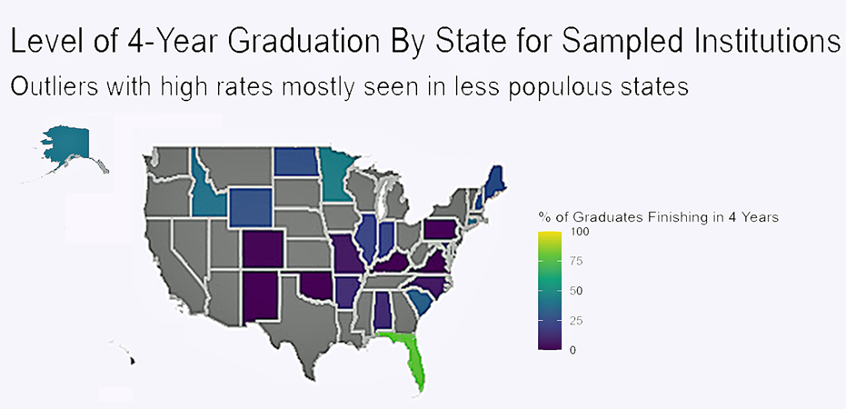

```{r setup, include=FALSE}
library(flexdashboard) # always
```

## Sidebar {.sidebar}

**All graphics based on 2018 data from the U.S. Department of Education's National Center for Education Statistics. The dataset contains self-reported responses from 2,141 Institutions in the United States Granting 4-Year Degrees**


## Column {.tabset .tabset-fade}

### Rates of 4-Year Graduation

```{r}
readRDS("ontimechart.rds")
```

### Institution Sizes (By Enrollment)

```{r}
readRDS("sizechart.rds")
```

### 4-Year Graduation Rate By Institution Size

```{r}
readRDS("bysizechart.rds")
```

### Map

```{r picture, echo = F, out.width = '100%'}

```


### References

Aden-Buie, G., Sievert, C., Iannone, R., Allaire, JJ, & Borges, B. (2023). Flexdashboard: R Markdown Format for Flexible Dashboards.

Leisch, F., & Team, R. C. (2024). Sweave User Manual.

Magallanes Reyes, J. M. (2022). Data Visualization for Social and Policy Research: A Step-by-Step Approach Using R and Python. Cambridge University Press. https://doi.org/10.1017/9781108625425

U.S. Department of Education. (2018). National Center for Education Statistics, Integrated Postsecondary Education Data System (IPEDS), [2018], [data set]. https://nces.ed.gov/ipeds/datacenter/InstitutionByName.aspx?goToReportId=1

US Census Bureau. (2023). TIGER/Line Shapefiles. Census.Gov. https://www.census.gov/geographies/mapping-files/time-series/geo/tiger-line-file.html


